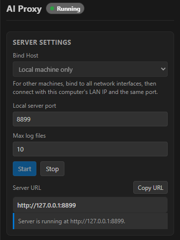
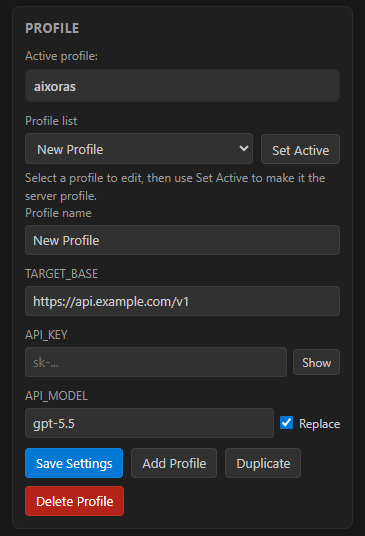

# AI Proxy

A professional VS Code extension for running and managing a local OpenAI-compatible AI proxy directly inside your editor.

AI Proxy gives teams a lightweight control center for routing AI requests through a local proxy, switching provider profiles, controlling bind settings, and collecting request/response logs per project. The UI is available from the Activity Bar and the bottom Panel, and VS Code can also move the view between locations using the standard view drag-and-drop workflow.



## Why AI Proxy

Modern AI development often requires testing multiple providers, models, API keys, and local network configurations. AI Proxy keeps that workflow inside VS Code so you can start, stop, inspect, and adjust your proxy without leaving the project you are working on.

Use it to:

- Run a local OpenAI-compatible proxy with one click.
- Switch between multiple provider profiles without editing scripts or environment files.
- Keep request logs under the active project root for easier debugging and audit trails.
- Bind locally for private development or expose the proxy to your LAN when testing from other machines.
- Package the extension as a VS Code Marketplace `.vsix` or an Open VSX `.vsix` artifact.

## Key features

### Server control panel

- Start and stop the proxy from the AI Proxy view.
- Choose the bind host:
  - Local machine only: `127.0.0.1`.
  - All network interfaces: `0.0.0.0`.
- Configure the local port, default `8899`.
- Configure max retained log files, default `10`.
- Copy the generated local server URL.
- Lock server settings while the proxy is running to prevent accidental runtime drift.

### Profile management

Create and maintain multiple proxy profiles. Each profile stores the target base URL, API key, model, and model-replacement behavior.



Profile settings include:

- `TARGET_BASE` — the upstream OpenAI-compatible base URL.
- `API_KEY` — the upstream API key used by the local proxy.
- `API_MODEL` — the model value to use when model replacement is enabled.
- `AI_MODEL_REPLACE` — when enabled, the proxy replaces the request `model` field with the selected profile model.

The active profile is used whenever the local proxy starts. Active profiles are protected from deletion so a running or ready-to-run configuration is not accidentally removed.

### Project-aware logs

AI Proxy writes logs to `.ai-proxy-logs` under the selected project root.

Project root behavior:

- Auto mode uses the active editor workspace when available.
- If no active editor workspace is available, it uses the first workspace folder.
- If no workspace is available, it falls back to the extension path.
- Manual mode lets you choose and remember a custom project root directory.

Log tools include:

- Open log directory.
- Open latest log.
- Clear logs.
- View extension output.

### Flexible VS Code placement

AI Proxy contributes views to both:

- The Activity Bar side container.
- The bottom Panel container.

You can use the built-in VS Code view context menu or drag-and-drop support to place the control view where it best fits your workflow.

## Getting started

### Run in development

1. Open the `ai-proxy` folder in VS Code.
2. Install dependencies:

   ```cmd
   npm install
   ```

3. Press `F5`, or use the `Run AI Proxy Extension` launch configuration.
4. Open the `AI Proxy` view from the Activity Bar or bottom Panel.
5. Configure a profile and click `Start`.

### Install from a packaged VSIX

After packaging, install the generated `.vsix` file with one of these options:

```cmd
code --install-extension dist\vscode-marketplace\ai-proxy-vscode-0.0.1.vsix
```

Or use VS Code:

1. Open the Extensions view.
2. Select `...` from the Extensions view title bar.
3. Choose `Install from VSIX...`.
4. Select the generated package.

## Configuration reference

| Setting                | Default                      | Description                                                                                |
| ---------------------- | ---------------------------- | ------------------------------------------------------------------------------------------ |
| Bind Host              | `127.0.0.1`                  | The local interface used by the proxy. Use `0.0.0.0` only when other machines need access. |
| Local server port      | `8899`                       | The port used by the local proxy server.                                                   |
| Max log files          | `10`                         | Maximum retained log files in `.ai-proxy-logs`.                                            |
| Project Root Directory | Auto                         | Controls where `.ai-proxy-logs` is created.                                                |
| TARGET_BASE            | `https://api.aixoras.com/v1` | Upstream OpenAI-compatible API base URL.                                                   |
| API_KEY                | empty                        | Upstream API key.                                                                          |
| API_MODEL              | `gpt-5.5`                    | Profile model used when replacement is enabled.                                            |
| AI_PROXY_MODEL_REPLACE | off                          | Replaces request `model` values only when checked.                                         |

## Network access notes

Use `127.0.0.1` for private local development. This only accepts connections from the same machine.

Use `0.0.0.0` when another machine on the same network needs to connect. Other machines should connect with your computer's LAN IP address and the configured port, for example `http://192.168.1.25:8899`.

Avoid binding to all interfaces on untrusted networks unless you understand the exposure risk.

## Security notes

AI Proxy stores profile configuration in VS Code extension workspace/global state. Treat API keys as sensitive data:

- Do not commit screenshots or logs containing real API keys.
- Do not publish packages with private credentials embedded in source files.
- Prefer local-only binding unless LAN access is required.
- Clear logs before sharing a workspace if logs may contain sensitive request or response data.

## Package for distribution

The development packaging helper lives in `dev/package-extension.js`.

From the `ai-proxy` directory:

```cmd
npm install
npm run package:vsix
npm run package:vsx
npm run package:all
```

Package scripts:

- `npm run package:vsix` creates a VS Code Marketplace-ready `.vsix` file under `dist/vscode-marketplace`.
- `npm run package:vsx` creates an Open VSX-ready `.vsix` file under `dist/open-vsx`.
- `npm run package:all` creates both outputs after cleaning `dist`.
- `npm run check` validates the extension and proxy server JavaScript syntax.

VS Code Marketplace and Open VSX both use `.vsix` packages. The separate output folders are provided for release clarity; Open VSX does not require a different binary package format.

## Publishing notes

### VS Code Marketplace

You can publish with `vsce publish` or manually upload the generated `.vsix` through the Visual Studio Marketplace publisher portal.

### Open VSX

You can publish with `ovsx`, for example:

```cmd
npx ovsx publish dist\open-vsx\ai-proxy-vscode-0.0.1.vsix -p <token>
```

Keep publishing tokens in a secure environment variable or secret store. Never commit tokens to the repository.

## Requirements

- VS Code `1.90.0` or newer.
- Node.js available to the VS Code extension host.
- Network access to your configured upstream OpenAI-compatible API endpoint.

## License

MIT
